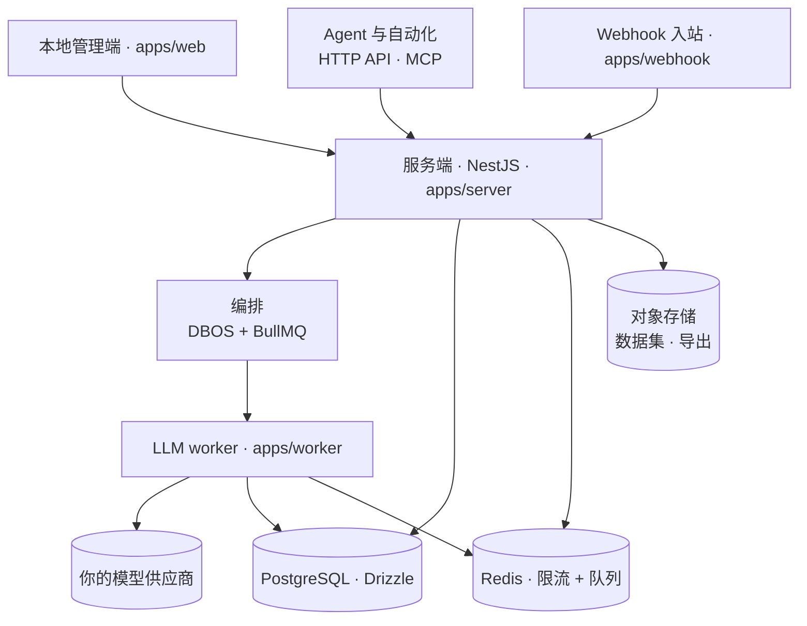

<p align="center">
  
</p>

<h1 align="center">ProofHound</h1>

<p align="center">
  <b>让提示词工程大幅省力的自托管平台</b><br/>
  覆盖完整生命周期，内置数据驱动的自动优化。<br/>
  版本、回归测试、实验、优化、发布、回滚——数据与模型都在你自己手里。
</p>

<p align="center">
  <a href="README.md">English</a> ·
  <a href="README.zh-CN.md">简体中文</a>
</p>

<p align="center">
  <a href="#快速开始">快速开始</a> ·
  <a href="#工作原理">工作原理</a> ·
  <a href="https://discord.gg/DGC6AzWrnt">Discord</a>
</p>

<p align="center">
  <a href="https://github.com/proofhound/proofhound"></a>
  <a href="https://discord.gg/DGC6AzWrnt"></a>
  <a href="LICENSE"></a>
  
  
  
  
  
</p>

<p align="center">
  <video src="https://github.com/user-attachments/assets/8290f7f3-0fc8-4464-87b1-d351b3d54fb5" controls muted playsinline width="100%" title="ProofHound 快速开始演示"></video>
</p>

ProofHound 把提示词工程变成一条数据驱动、可追溯的工作流。不必再东拼西凑脚本、临时实验、表格和手写的上线逻辑——数据集回归、实验、自动优化、灰度与正式发布、不可变的运行结果与回滚，整条闭环都在一个地方完成，自托管在你自己掌控的基础设施上。

它首先为开发者而建：clone、`pnpm dev`、接上一个模型，几分钟就能开始做实验。而因为整套调优流程围绕数据集、指标和提示词版本被产品化，非技术成员也能定义目标、启动优化、推进发布。开源版以单工作区的本地管理端形态运行，并保留 `project_id` 数据边界，便于未来接入外部控制面而不改动核心资源语义。

## 能力清单

ProofHound 跑的是同一条生命周期，每个阶段都写入同一套事实表——所以一次模型调用从数据集样本一路到线上表现都可追溯，并能反查回来：

- **提示词版本** —— 每次修改都生成一个不可变版本，连同变量、输出字段与判定规则；一旦被实验、优化或发布引用即被冻结，因此每个结果都能对应到当时确切的提示词内容。
- **数据集回归** —— 用一个版本跑带期望输出的数据集（CSV / TSV / JSONL / JSON 数组 / ZIP），得到 Accuracy、Precision、Recall、F1、分类维度指标、失败样本与完整调用明细——而不是一个会掩盖少数类表现的整体分数。
- **实验** —— 批量跑 提示词版本 × 数据集 × 模型，可停止、恢复、跨轮对比并导出；因为所用版本已冻结，每次运行都可复现。
- **自动优化** —— 分析失败样本、生成新的候选版本、逐轮重跑回归，可针对类别级目标（例如提升某高风险类别的 Recall），并在某轮退步时回退到历史最佳版本。
- **灰度与正式发布** —— 把验证过的版本通过队列连接器做灰度发布，支持切流与双跑，再到 100% 晋升、配置变更、回滚与强制停止；webhook 入站可直接进入正式环境。
- **运行结果** —— 以上每个阶段的每次调用都写入一条不可变记录：输入变量、渲染后的提示词、原始输出、结构化输出、判定、耗时、Token 与成本。
- **人工标注** —— 写入独立表，绝不修改原始运行结果。
- **连接器** —— 把提示词接到队列连接器与 webhook 入站，承接线上流量。
- **MCP 通道** —— 内置，Agent 可管理提示词版本、启动实验 / 优化、查询结果。
- **自带模型** —— OpenAI、Azure OpenAI、Anthropic、DeepSeek 等，用你自己的 Key 与定价。

## 快速开始

你需要：

- Node.js 24
- pnpm
- Docker 与 Docker Compose

PostgreSQL、Redis 等本地依赖服务由 Docker Compose 自动启动，无需手动安装。

```bash
git clone https://github.com/proofhound/proofhound.git
cd proofhound
pnpm install
cp .env.example .env
pnpm dev
```

`pnpm dev` 会启动本地依赖服务、执行数据库迁移，并同时拉起 server、webhook、worker 和 web。

首次运行前，在 `.env` 里设置两个由应用自管的密钥（缺失会导致启动或调用模型失败）：

- `MODEL_API_KEY_ENCRYPTION_KEY` —— 加密你存储的模型 API Key
- `MCP_TOKEN_SIGNING_SECRET` —— 为 MCP Token 签名

`DATABASE_URL` 与 `REDIS_URL` 已指向 Docker Compose 启动的服务。

默认本地服务：

| 服务 | 地址 |
| --- | --- |
| 本地管理端 | http://localhost:3000 |
| 服务端 API | http://localhost:4000 |
| PostgreSQL | localhost:5432 |
| Redis | localhost:6379 |
| Kafka | localhost:9092 |
| Redpanda Console | http://localhost:8088 |
| RedisInsight | http://localhost:5540 |

## 工作原理

ProofHound 是一个按模块边界拆分的 TypeScript 单体，配一个负责 LLM 调用的 Node.js worker。三个入口驱动它——本地管理端、给 Agent 与自动化用的 HTTP API + MCP 通道、以及按连接器划分的 webhook 入站——它们共享同一套编排与存储。



| 层 | 选型 |
| --- | --- |
| 前端 | Next.js + TypeScript + Refine + shadcn/ui + Tailwind |
| 后端 | NestJS 单体，按模块边界拆分 |
| 数据库 | PostgreSQL + Drizzle ORM（`ph_*` schema），不依赖专有 SQL 扩展 |
| 编排 | DBOS + BullMQ + Node.js LLM worker |
| 限流 | Redis 集中限流（RPM / TPM / 并发） |
| 存储 | 可替换的 `StorageProvider`（数据集与导出） |
| 日志 | Pino，stdout JSON；每次 LLM 调用在写入运行结果前都记录完整入参与响应 |

## 模型与供应商

ProofHound 不转卖模型调用，也不在用量上加价——你自带供应商，花费只发生在你和你的供应商之间。

- **快捷预设** —— 从主流供应商的预设开始，只需填入凭证、配额、单价与能力声明，无需逐项手动配置。
- **充分可配置** —— 每个模型可设置 endpoint、API Key、单价（用于成本核算）、上下文窗口、图片能力，以及 RPM / TPM / 并发上限；限额由 Redis 集中计数、按模型统一执行。
- **自动并发调整，默认开启** —— 不用你手算多大并发才能跑满 RPM / TPM，ProofHound 会基于实时延迟与 Token 用量（Little 定律）动态调整有效在途并发，并在供应商返回 429 时自动退避（AIMD），始终以你配置的并发上限作为安全帽。

内置供应商类型：OpenAI · Azure OpenAI · Anthropic · DeepSeek · Kimi · MiniMax · Qwen · ERNIE —— 以及任何通过开放字符串接入的 OpenAI 兼容 endpoint。

## ProofHound 的不同之处

**靠数据事实，而非直觉。** ProofHound 把样本、判定、指标、失败模式与版本演化串成一条闭环。团队少花时间写脚本、临时定义结构、手工比对结果——提示词调优也不再只由少数工程师掌握。

**为分类与不均衡数据而建。** 开源版优先服务分类任务，尤其是风控、金融、审核、客服意图识别等类别不均衡明显的场景。per-class 指标贯穿始终，整体准确率绝不掩盖少数类的真实表现。

**从实验到生产的完整链路。** ProofHound 不只是提示词版本库，也不只是评测工具。数据集、实验、优化、发布与运行结果在同一条生命周期里——你能追溯一个版本为何上线、上线前跑过什么、灰度与正式环境表现如何、以及后来为何回滚。

**自托管，少绑定。** 存储用 PostgreSQL、集中限流用 Redis、日志走 stdout JSON——模型、凭证、供应商与用量成本都掌握在你自己手里。

## 开发中

- **生成式任务优化** —— 在当前以分类为先的流程之外，扩展面向生成式任务的评估、比较与优化策略。
- **ProofHound Cloud** —— 托管版，降低部署与运维成本。_即将上线。_

## 项目结构

```text
proofhound/
├── apps/
│   ├── server     # NestJS API、MCP 通道、SSE
│   ├── webhook    # 连接器 webhook 入站
│   ├── worker     # BullMQ LLM worker
│   └── web        # Next.js 本地管理端
├── packages/      # shared, db, crypto, providers, llm-client, judgment,
│                  # optimization-strategy, limiter, metrics, logger,
│                  # orchestration-shared, connector-client, api-client, ui
├── dev/           # 本地依赖服务的 docker-compose
├── docs/specs/    # 业务 SPEC —— 事实来源
└── datasets/      # 示例与本地数据集
```

## 参与贡献

ProofHound 还很早期，非常欢迎社区参与。你可以：

- 提 **Issue**：反馈 Bug、安装问题、模型接入问题或真实工作流反馈。
- 提 **Pull Request**：改进文档、修复问题、补充测试或优化交互体验。
- **扩展能力**：新增模型供应商、连接器、数据集解析、实验指标或优化策略。
- **分享场景**：尤其欢迎分类、不均衡数据集、风控、金融、审核、客服意图识别等场景。

如果不确定某个想法是否契合项目，建议先开 Issue 讨论背景与预期行为。

## 社区与支持

- **Discord** —— 最适合提问、求助安装、与其他用户交流：https://discord.gg/DGC6AzWrnt
- **微信群** —— 扫描下方二维码加入。
- **QQ 群** —— 318412485。
- **GitHub Issues** —— 最适合 Bug、安装问题、模型接入问题与功能请求。
- **邮箱** —— 最适合私密或敏感话题：z@proofhound.org

<p align="center"></p>

## 许可证

ProofHound 基于 [Apache License 2.0](LICENSE) 开源。
